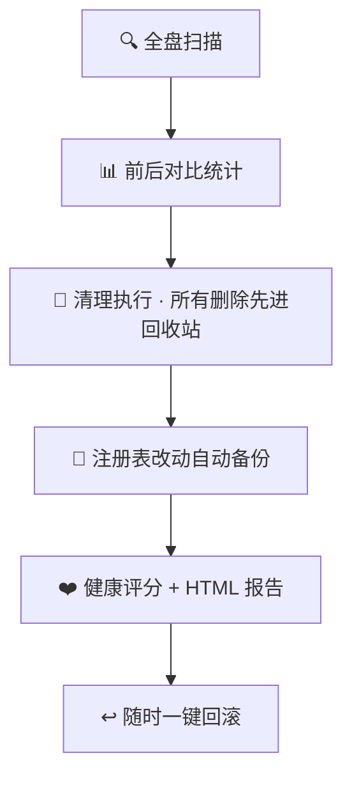

# 🛠 WinCleanPro


   


> Windows 全家桶一键清理优化工具 · 纯 PowerShell 脚本 · 双击即用 · 安全可回滚

作者：ChenQiyue · 最后更新：2026-08-06

---

## 📌 项目简介

WinCleanPro 是一个**零依赖、单文件、双击即用**的 Windows 清理优化工具，整合了市面上主流开源工具（BleachBit、Chris Titus Windows Utility、Win11Debloat、Sifty、Multron Win Cleaner、Kudu、optimizerDuck 等）的常用功能，并加入自研差异化能力：

- **🛡 前后对比报告** —— 清理前后自动统计磁盘占用、垃圾量、释放空间，生成可视化 HTML 报告
- **↩️ 可回滚还原** —— 所有删除先进回收站；注册表改动前自动备份，支持一键还原
- **❤️ 系统健康评分** —— 基于垃圾量 / 磁盘剩余 / 启动项 / 内存计算 0~100 分
- **⏱ 开机耗时追踪** —— 读取系统事件日志，查看最近 5 次开机耗时，验证优化效果
- **💤 休眠文件管理** —— 一键关闭休眠释放 `hiberfil.sys`（可释放数 GB 到数十 GB）
- **🕵️ 隐私痕迹清理** —— 清除最近文档 / 运行历史 / 搜索历史 / 跳转列表
- **🧑‍💻 开发者专项清理** —— 专门扫描 `node_modules` / `__pycache__` / `.gradle` 等开发垃圾

> 与市面上「永久删除、不可撤销」的工具不同，WinCleanPro 以安全为先：所有删除操作都走回收站，注册表改动全部可还原。

---

## 🧹 清理流程



## 🖥 界面预览

启动后显示 **ASCII Logo + 引导式分区菜单**，顶部带实时系统状态栏（磁盘/内存进度条）和健康评分，每个选项都写明作用：

```
   _       __     __   _          __  __
  | |     / /__  / /_ (_)______ _/ / / /
  | | /| / / _ \/ __// // __ `// /_/ /
  | |/ |/ /  __/ /_ / // /_/ // __  /
  |__/|__/\___/\__//_/ \__,_//_/ /_/
        __  ______                  __
       /  |/  / _/___  ____  ____ _/ /_
      / /|_/ / // __ \/ __ \/ __ `/ __/
     / /  / / // /_/ / / / / /_/ / /_
    /_/  /_/_/ \____/_/ /_/\__,_/\__/

  ╔══════════════════════════════════════════════════════════════╗
  ║   WinCleanPro v4.0 ·  Windows 全家桶清理优化                  ║
  ║   作者: ChenQiyue · 安全优先: 删除进回收站 / 改动可还原           ║
  ╚══════════════════════════════════════════════════════════════╝

  ┌──────────────────────────────────────────────────────────────┐
  │ 磁盘: 45.2 GB 空闲 / 237 GB (19%)                            │
  │      [██████████████░░░░]                                    │
  │ 内存: 6.1 GB 空闲 / 16 GB (38%)                              │
  │      [███████░░░░░░░░░░░]                                    │
  │ 垃圾量约: 1200 MB   启动项: 8 个                             │
  │ 健康评分: 72 / 100                                           │
  └──────────────────────────────────────────────────────────────┘

  ── 清理类 (让磁盘更干净) ────────────────────────────────────────
   [1]  磁盘清理          清除临时文件/回收站/更新缓存/浏览器缓存
   [2]  去广告 / 精简     关闭开始菜单推荐/锁屏广告/遥测/后台应用
   ... (24 个功能, 顶部系统信息随检测实时变化)
```

> 上述磁盘/内存数据是示例, 实际值由脚本自动检测, 随系统实时变化。

清理过程带**实时进度条**，一键全做结束后显示**战报 + 条形图**，并自动打开**深色科技风 HTML 报告**（SVG 环形评分图 + 动画条形图 + 渐变卡片）。

---

## 🚀 快速开始（三种方式）

### 方式一：双击运行（推荐，无需命令行）

1. 下载 `WinCleanPro.bat` 和 `WinCleanPro.ps1`，放在**同一文件夹**
2. **双击 `WinCleanPro.bat`** → 自动进入交互式菜单
3. 需要管理员权限的功能会自动弹出 UAC 确认（最小权限原则，普通功能不打扰）
4. 按提示选择功能（输入数字回车）

### 方式二：命令行一键全做（推荐，最省事）

以管理员身份打开 **PowerShell 或 终端**，执行：

```powershell
# 一键清理 + 去广告 + 性能优化 + 开发者清理, 自动出对比报告
powershell -NoProfile -ExecutionPolicy Bypass -File .\WinCleanPro.ps1 -RunAll
```

> 脚本会自动请求管理员权限并透传参数，无需手动提权。

### 方式三：命令行深度清理（最彻底）

```powershell
# 深度模式: 一键全做 + WinSxS 组件清理 + 预装应用精简 + 网络优化 + 系统修复
powershell -NoProfile -ExecutionPolicy Bypass -File .\WinCleanPro.ps1 -RunAll -Deep
```

> `-Deep` 会额外运行 DISM 组件清理和 SFC 系统修复，**耗时可能 30-60 分钟**，建议在不需要使用电脑时运行。

---

## 🏃 在线一键运行（无需下载到项目目录）

脚本已托管在 GitHub，可直接从 Raw 直链下载到临时目录并执行，**无需克隆仓库**：

```powershell
# 交互式菜单
powershell -NoProfile -ExecutionPolicy Bypass -Command "$p='%TEMP%\WinCleanPro.ps1'; iwr 'https://raw.githubusercontent.com/qiyuechen0929/WinCleanPro/main/WinCleanPro.ps1' -UseBasicParsing -OutFile $p; powershell -NoProfile -ExecutionPolicy Bypass -File $p"

# 一键全做
powershell -NoProfile -ExecutionPolicy Bypass -Command "$p='%TEMP%\WinCleanPro.ps1'; iwr 'https://raw.githubusercontent.com/qiyuechen0929/WinCleanPro/main/WinCleanPro.ps1' -UseBasicParsing -OutFile $p; powershell -NoProfile -ExecutionPolicy Bypass -File $p -RunAll"

# 深度清理
powershell -NoProfile -ExecutionPolicy Bypass -Command "$p='%TEMP%\WinCleanPro.ps1'; iwr 'https://raw.githubusercontent.com/qiyuechen0929/WinCleanPro/main/WinCleanPro.ps1' -UseBasicParsing -OutFile $p; powershell -NoProfile -ExecutionPolicy Bypass -File $p -RunAll -Deep"
```

> `iwr` = `Invoke-WebRequest`。脚本会下载到 `%TEMP%\WinCleanPro.ps1`，再用 `-File` 参数正常运行（这样 `-RunAll` / `-Deep` 才能正确传递）。
> ⚠️ 如果仓库默认分支不是 `main`（比如 `master`），把命令里的 `main` 改成你的默认分支名。

---

## ✨ 功能总览（24 项）

| 分类 | 功能 | 说明 |
|------|------|------|
| **清理类** | `[1]` 磁盘清理 | 临时文件 / 回收站 / 更新缓存 / 更新旧日志 / 传递优化 / 缩略图 / 字体缓存 / 浏览器缓存 / WER 错误报告 / 崩溃转储 / 着色器缓存 / CBS 日志 |
| | `[2]` 去广告 / 精简 | 开始菜单推荐 / 锁屏广告 / Copilot 按钮 / 必应搜索 / 遥测 / 后台应用 |
| | `[3]` 重复文件查找 | SHA1 哈希查重，自动保留每组第一个 |
| | `[4]` 空间分析 | 扫描大目录占用 TOP10，导出报告 |
| | `[5]` 大文件查找 | 找出超过指定大小的巨型文件 |
| | `[6]` 开发者专项清理 | `node_modules` / `__pycache__` / `.gradle` / WSL2 虚拟盘检测 |
| | `[7]` 内存清理 | 释放空闲进程内存工作集 |
| | `[8]` 休眠文件管理 | 关闭休眠释放 `hiberfil.sys`（可释放数 GB~数十 GB） |
| **管理类** | `[9]` 软件更新 | winget 一键更新全部软件 |
| | `[10]` 软件卸载 | winget 搜索并卸载不需要的软件 |
| | `[11]` 启动项管理 | 查看 / 禁用 / 启用开机自启项目 |
| | `[12]` 服务优化 | 分析高占用服务，给出安全调整建议 |
| | `[13]` 计划任务查看 | 列出系统计划任务 |
| | `[14]` 预装应用管理 | AppX Debloat，移除不需要的预装应用 |
| **网络与修复** | `[15]` 网络优化 | 刷新 DNS / 重置 Winsock / 重置 TCP/IP |
| | `[16]` 系统修复 | DISM 映像健康检查 + SFC 系统文件扫描 |
| | `[17]` Defender 扫描 | 快速病毒扫描 |
| | `[18]` 系统信息 | 查看硬件 / 系统 / 显卡 / 主板详情 |
| **特色功能** | `[19]` 开机耗时追踪 | 查看最近 5 次开机耗时，验证优化效果 |
| | `[20]` 隐私痕迹清理 | 清除最近文档 / 运行历史 / 搜索历史 / 跳转列表 |
| **一键与安全** | `[21]` 一键全做 | 清理 + 去广告 + 性能 + 开发者清理，自动生成对比报告 |
| | `[22]` 创建还原点 | 系统修改前创建还原点 |
| | `[23]` 还原注册表备份 | 选择历史备份一键还原 |
| | `[24]` HOSTS 广告拦截 | 添加/查看/还原 hosts 广告与遥测拦截条目 |

---

## 🛠 命令行参数

| 参数 | 说明 |
|------|------|
| （无参数） | 进入交互式菜单 |
| `-RunAll` | 一键全做：磁盘清理 + 去广告 + 性能优化 + 开发者清理，自动生成对比报告，跳过确认 |
| `-Deep` | 深度清理：在 `-RunAll` 基础上，附加 WinSxS 组件清理 / 预装应用精简 / 网络优化 / 系统修复 |
| `-RunAll -Deep` | 组合使用，最彻底的清理（耗时较长） |

---

## 📊 对比报告效果

一键全做结束后，自动打开一份 HTML 报告，包含：

- 清理前 / 清理后可用空间对比
- 释放磁盘空间、清理的垃圾量、删除文件数
- 开发者缓存释放量
- 系统健康评分
- 本次执行内容、系统信息、备份位置

报告保存在 `%LOCALAPPDATA%\WinCleanPro\reports\`。

---

## 🔒 安全机制

| 机制 | 说明 |
|------|------|
| **回收站删除** | 所有文件删除走系统回收站，误删可还原 |
| **注册表备份** | 改动前自动 `reg export` 备份到 `%LOCALAPPDATA%\WinCleanPro\backups\` |
| **一键还原** | 菜单 `[23]` 选择历史备份导入还原 |
| **还原点** | 菜单 `[22]` 创建系统还原点；`-RunAll` 一键全做会自动先创建还原点 |
| **最小权限** | 交互模式不提前提权，只有选到需要管理员的功能时才请求 UAC |
| **HOSTS 备份** | 修改 hosts 前自动备份 |
| **关键路径保护** | 不触碰系统关键目录，删除操作逐条可控 |
| **关键组件保护** | AppX 卸载时自动保护计算器/商店/终端等；软件卸载自动排除 Edge/Defender/.NET |

> ⚠️ 使用建议：首次使用建议先选 `[22]` 创建还原点，再执行一键全做。

---

## 🧩 技术实现

- **纯 PowerShell + 系统自带命令**：DISM、SFC、netsh、powercfg、winget、reg 等，零第三方依赖
- **回收站删除**：`Microsoft.VisualBasic.FileIO`（`SendToRecycleBin`）
- **内存清理**：`EmptyWorkingSet` Win32 API
- **重复文件**：SHA1 哈希 + 文件大小分组双重校验，自动跳过 Windows 自维护目录
- **启动项管理**：注册表 `StartupApproved\Run` 二进制值控制启停
- **对比报告**：清理前后状态采集 → 动态生成 HTML

---

## 📁 文件结构

```
WinCleanPro/
├── WinCleanPro.ps1    # 主脚本 (24 个功能模块 + 引导式菜单 + 一键/深度模式)
├── WinCleanPro.bat    # 双击启动器 (自动透传命令行参数)
└── README.md
```

---

## ⚖️ 免责声明

本工具仅供个人学习使用。清理、精简、优化操作可能影响系统功能（如移除预装应用、关闭遥测），请自行判断风险。使用本工具造成的任何损失，作者不承担责任。

---

© 2026 ChenQiyue · 最后更新：2026-08-06
